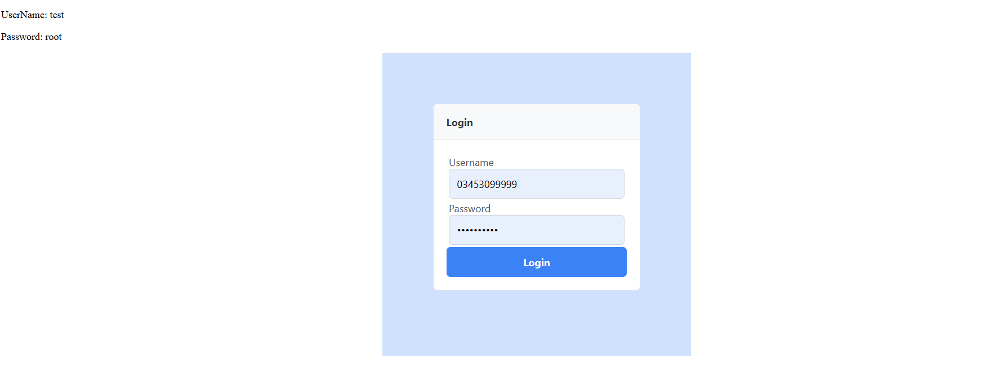
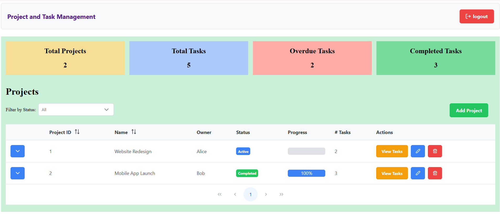
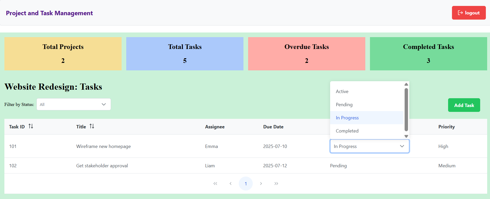
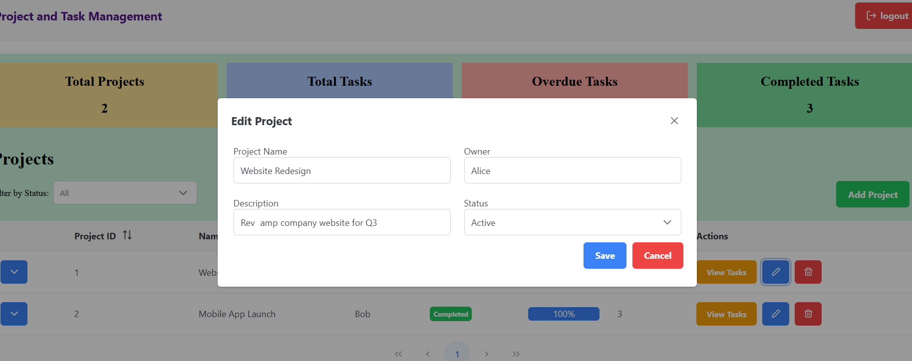
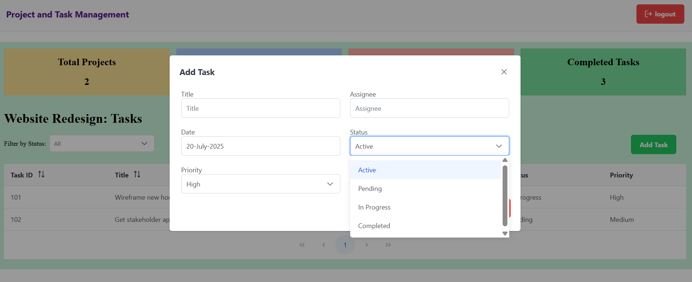
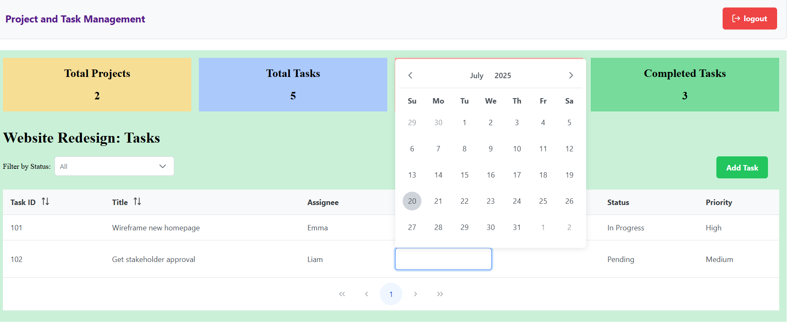

# ProjectTaskManagement

This project was generated with [Angular CLI](https://github.com/angular/angular-cli) version 15.2.11.

## Development server

Run `ng serve` for a dev server. Navigate to `http://localhost:4200/`. The application will automatically reload if you change any of the source files.

## Code scaffolding

Run `ng generate component component-name` to generate a new component. You can also use `ng generate directive|pipe|service|class|guard|interface|enum|module`.

## Build

Run `ng build` to build the project. The build artifacts will be stored in the `dist/` directory.

## Running unit tests

Run `ng test` to execute the unit tests via [Karma](https://karma-runner.github.io).

## Running end-to-end tests

Run `ng e2e` to execute the end-to-end tests via a platform of your choice. To use this command, you need to first add a package that implements end-to-end testing capabilities.

## Further help

To get more help on the Angular CLI use `ng help` or go check out the [Angular CLI Overview and Command Reference](https://angular.io/cli) page.
<!-- ///////////////////////////// Project guidelines -->
## setup Instruction
Follow these steps to set up and run the Angular project on your local machine.

## Prerequisites

- [Node.js v18.18.0](https://nodejs.org/en/download/)
- npm (comes with Node.js)
- Angular CLI v15 (install using: `npm install -g @angular/cli@15`)

## Steps to Run the Project

unzip the folderName projectTaskManagement.zip
open the folder and go the cmd terminal
run npm install
and start the server with npm start

and the app should now be  running at 
http://localhost:4200

## Project Structure
In the **Project Task Management** system, the following structural and architectural practices have been implemented to ensure scalability, maintainability, and responsiveness:

## UI & Responsiveness:
Utilized **PrimeNG** for building a clean and consistent user interface.
Used **PrimeFlex** utility classes to achieve responsive and flexible layout design.

## Code Scalability & Structure:
  Followed **Angular CLI standards** to generate components, services, and modules for a cleaner codebase.
  Ensured the use of appropriate Angular CLI commands such as:
    ng generate component component-name
    ng generate service service-name

## Modular Architecture:
  Divided the project into three main modules for clear separation of concerns:
  `AppModule` – the root module to bootstrap the application.
  `MainModule` – responsible for core application features and dashboard views.
 `AuthModule` – handles all authentication-related components and logic.

## Service Layer Design:
Created services based on specific features and dependencies.
Ensured each service is responsible for a single concern (e.g., task management, authentication).

## Requirement Coverage:
Implemented all major functional points mentioned in the requirement sheet.
Covered as many **bonus points** as possible, aiming to go beyond just the minimum.

## UI Utility Implementation:
  Integrated all required PrimeNG components and UI utilities as outlined in the project scope.

## ScreenShots

## assumptions made

- Login credentials are already provided at the top-left corner for easy access during testing.
- Authentication is managed using localStorage if it's cleared manually, the user needs to reload the app to exit the dashboard.
- All data is based on mock JSON files and does not come from a live backend.
- State variables are not hydrated using localStorage, so reloading the app resets all data to the initial state.
- Loaders and setTimeout delays are used purely to simulate real-time interactivity and provide a better user experience.
- Some features are implemented to demonstrate the concept and could be replaced or extended with more robust solutions in a production environment.

